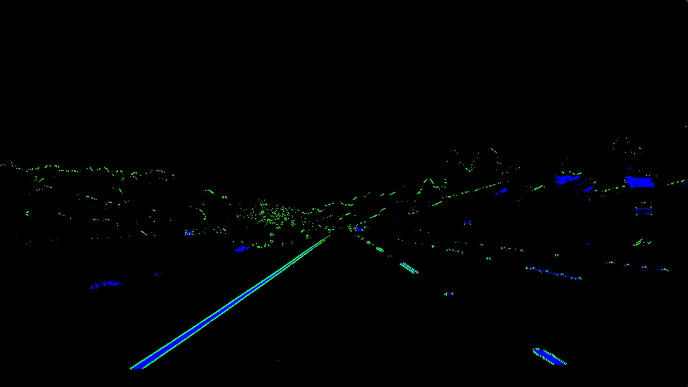
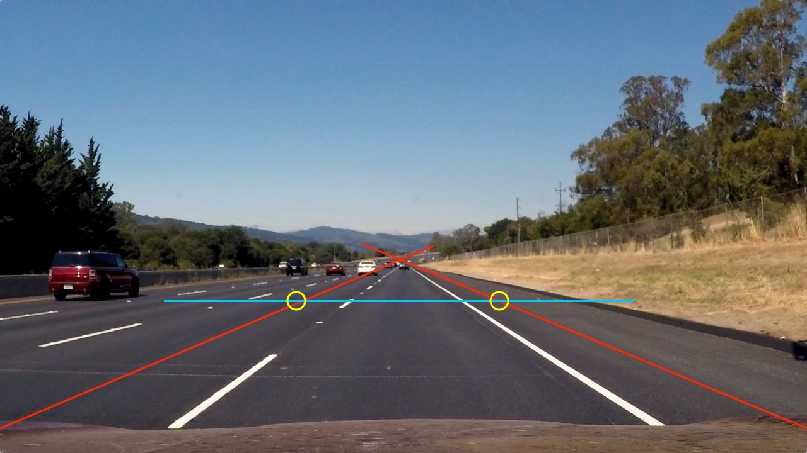
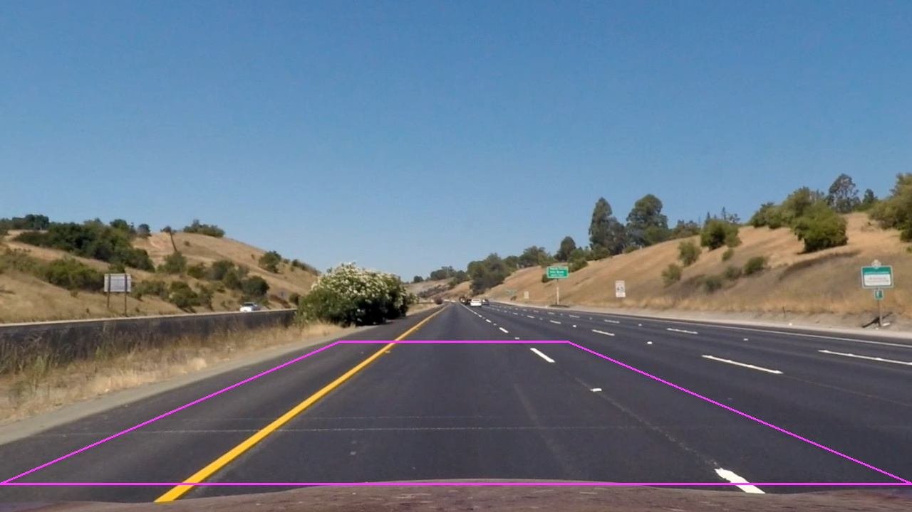
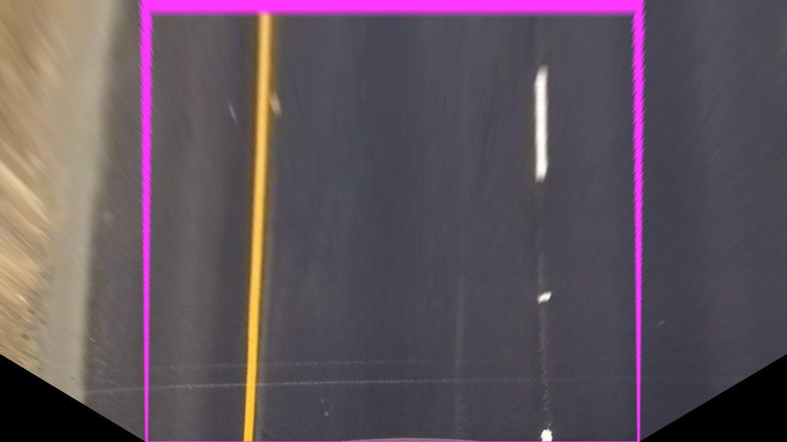
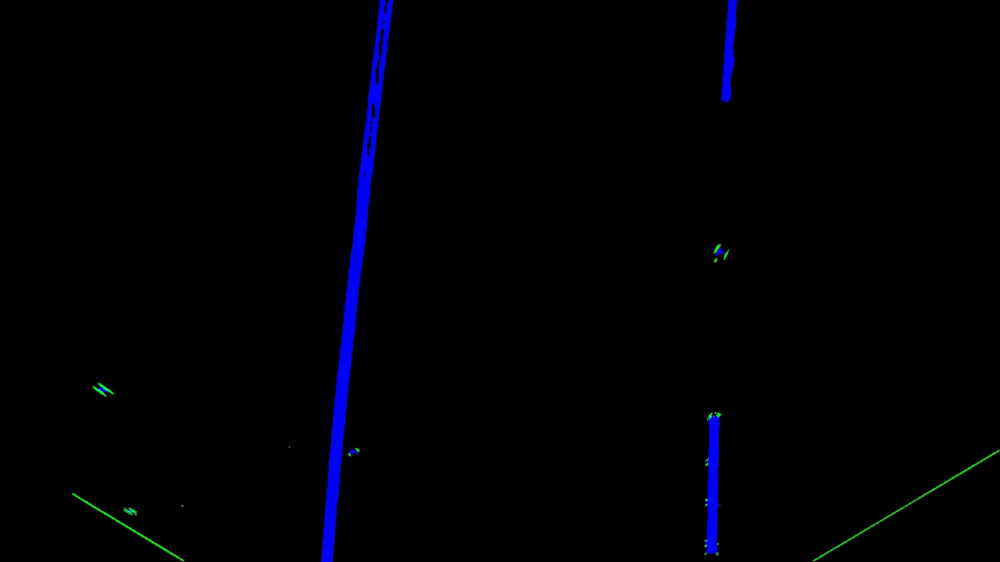
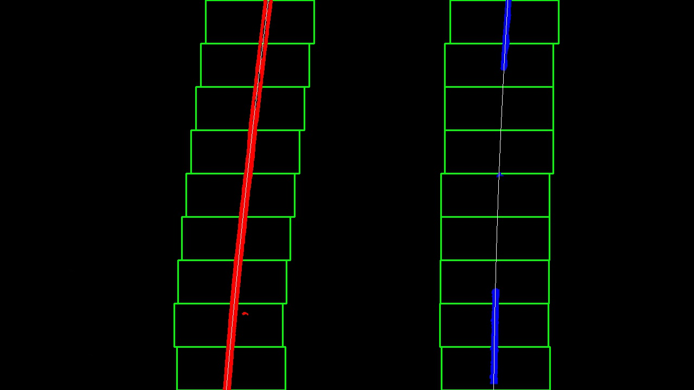
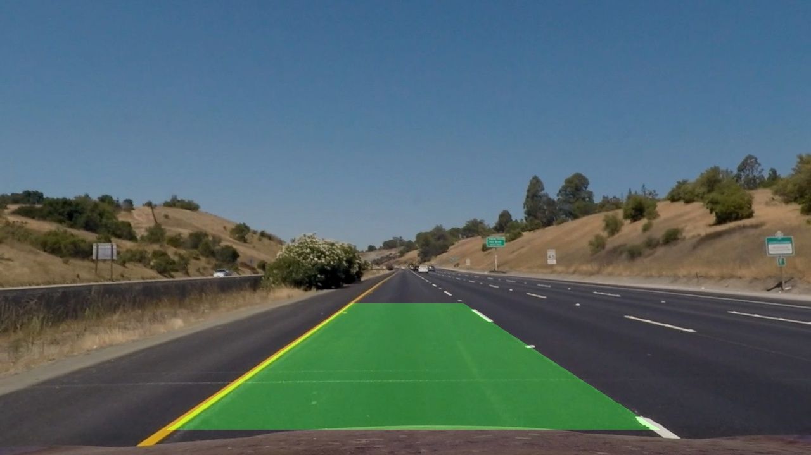
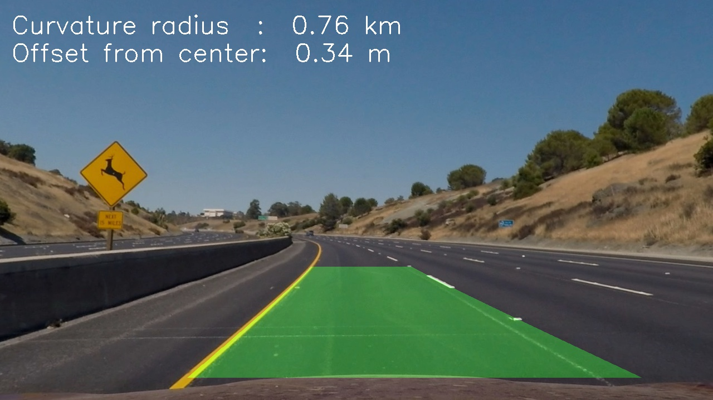
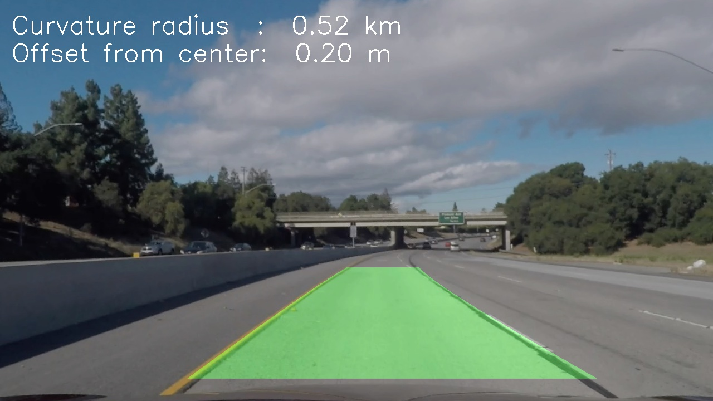

## Advanced Lane Finding

The goals / steps of this project are the following:

* Compute the camera calibration matrix and distortion coefficients given a set of chessboard images.
* Apply a distortion correction to raw images.
* Use color transforms, gradients, etc., to create a thresholded binary image.
* Apply a perspective transform to rectify binary image ("birds-eye view").
* Detect lane pixels and fit to find the lane boundary.
* Determine the curvature of the lane and vehicle position with respect to center.
* Warp the detected lane boundaries back onto the original image.
* Output visual display of the lane boundaries and numerical estimation of lane curvature and vehicle position.

[//]: # (Image References)

[image1]: ./camera_cal/calibration1.png "Raw Camera Image"
[image2]: ./output_images/calibration1_undist.jpg "Undistorted"

## [Rubric](https://review.udacity.com/#!/rubrics/571/view) Points
Below I will list the rubric points individually and describe how I addressed each point in my implementation.  

---
###Writeup / README

####1. Provide a Writeup / README that includes all the rubric points and how you addressed each one. 

You're reading it!

###Camera Calibration

####1. Briefly state how you computed the camera matrix and distortion coefficients. Provide an example of a distortion corrected calibration image.

I wrote a class to handle the calibration of the camera.  You will find it in the `UtilCamera.py` file starting on line 10.  On line 13 the `__init__()` method will check to see if we've already calibrated the camera by looking for a file named `camera_calibration.p`.  If the file exists then the class just loads the data.  If not, it will use the function on line 25 to do the camera calibration and store the resulting data in the pickle file for next time.  So in the `calibrateCamera()` function on line 25 I prepare some data structures to hold object points of where the corners of the chessboard are.  Since it is a flat poster we can assume that z=0 for every corner.  We then read in all the images from the `camera_cal` folder and attempt to find the chessboard corners with the CV2 function `findChessboardCorners()`.  If the corners are found the resulting locations of these corners are stored in `imgpoints` and the original locations are stored in `objpoints`.  Once I have those arrays of corner points, I use the CV2  function `calibrateCamera()` to calculate the camera matrix and the distortion coefficients.  These are stored for later use.  Clients of the Camera class can call the `undistort()` method.  An example camera calibration image is shown below on the left, and the corrected undistorted image is shown on the right:

----

###Pipeline (single images)

####1. Provide an example of a distortion-corrected image.

On line 16 of the `main.py` file you will find the top-level image pipeline function.  The first step happens on line 24 which is the camera class performing an un-distortion of each image.  Below you will see an original test image on the left, and an undistorted version on the right:

####2. Describe how (and identify where in your code) you used color transforms, gradients or other methods to create a thresholded binary image.  Provide an example of a binary image result.

On line 82 of the `UtilMask.py` file you will find the main function for converting an image to a binary image that highlights the gradients, and colors of the source image.  It returns an image that is the same size as it was given, but it has blacked out all pixels except for qualifying gradients in the green channel, and qualifying colors in the blue channel.  Below is a raw image on the left, and on the right the gradients and colors that have been returned from this function:

####3. Describe how (and identify where in your code) you performed a perspective transform and provide an example of a transformed image.

On line 8 of the file `UtilMask.py` I define a class called "Perspective".  The class is used to do perspective transforms on images.  On the very first use of the class, the `calcTransform()` method is called so that a perspective transformation can be calculated.  For this project, I knew the exact size of all the camera images, so I just hard-coded values for a perspective transform.  I started with the lower left and right points that I just set at the far left and right of the camera view, just above the hood of the car.  I then used a simple image editor to estimate where parallel lines would end up.  I then drew a horizontal line 480 pixels from the top of the image and estimated where it crossed the parallel lines.  The image below was used for this purpose:

From this image, the left and right x values turned out to be `476` and `796` respectively.  When calculating the locations of these points from a top-down perspective, I could just use 1/2 of 476 for the left side since my left-bottom point was at x=0.  For the right, 1280 - 796 = 484, and 1/2 of 484 is 242.  So that is the x value on the right side. This results in the following perspective points:

| Source        | Destination   | 
|:-------------:|:-------------:| 
|  476, 480     |  238, 0       | 
|  796, 480     | 1038, 0       |
| 1280, 680     | 1038, 720     |
|    0, 680     |  238, 720     |

I verified that my perspective transform was working as expected by drawing the `src` and `dst` points onto a test image.  I then used the CV2 `warpPerspective()` to generate a warped version of the image and inspected the resulting lines to see if they were parallel.  The images below were used for verification:

####4. Describe how (and identify where in your code) you identified lane-line pixels and fit their positions with a polynomial.

I wrote class called "LaneLines" on line 12 of the `UtilLines.py` file.  The class is used to find and keep track of lane lines over many sequential images from a camera.  On line 19 the method `processFrame()` is the main method to call with each new frame from the video camera.  It will mask the top-down image, get the binary version, and then perform the line searching.  If we have established lane lines previously then the `updateLanes()` method will be used, and if we have no lane lines it will call the `blindSearch()` method.

The `updateLanes()` method will use the update method from the project lecture.  It will hightlight any pixels within 100 pixels of the previous curve fit polynomials for left and right.

The `blindSearch()` method will use the histogram method covered in the project lecture material.  Windows will be walked up from the bottom of the frame and will highlight any pixels in the left or right windows.

After one of the above methods finds pixels to include in the left and right lanes, the `fitLines()` method is then called.  This method uses the NumPy `polyfit()` function to calculate a polynomial of second order through the points given.  

The resulting polynomial, lane pixels, and search boxes are all output for debugging and testing purposes shown below.  Left lane pixels are in red, right lane pixels are in blue:

####5. Describe how (and identify where in your code) you calculated the radius of curvature of the lane and the position of the vehicle with respect to center.

In the "LaneLines" class within the `UtilLines.py` file, the method `fitLines()` will also estimate the curvature of the road, and the position of the car within the road.  On line 196, I calculate the location of the left and right lanes at the very bottom of the image.  I then calculate the lane width in pixels, the center pixel of the lane, and then subtract the actual mid-point of the camera image to get the car offset.  I then multiply the resulting values by how many meters are represented by each pixel to get distances in meters.  

On line 205 I calculate a polynomial fit of the lane line after converting hte points to meters.  From these curve fits I calculate the curvature of the left and right lane lines.  These steps were taken from the project course material.  I then do a weighted average based on how many pixels were counted in each lane to arrive at a final lane curvature value.  

####6. Provide an example image of your result plotted back down onto the road such that the lane area is identified clearly.

On line 53 of the `UtilLines.py` file I provide the `getLaneFill()` method to generate a polygon filled with green that denotes the safe area of the lane in the image.  It is returned to the client for blending into the original image.  An example:

---

###Pipeline (video)

####1. Provide a link to your final video output.  Your pipeline should perform reasonably well on the entire project video (wobbly lines are ok but no catastrophic failures that would cause the car to drive off the road!).

Here is a link to my result of the project video:

<a href="./out-project_video.mp4">
 </img>
</a>

---

###Discussion

####1. Briefly discuss any problems / issues you faced in your implementation of this project.  Where will your pipeline likely fail?  What could you do to make it more robust?

This project was fairly difficult from an image processing perspective.  I don't have much experience with image processing, so many of the concepts were new to me.  I found it difficult to properly extract the yellow and white lane lines, and it turned out that the color extractions were key.  I was originally using gradients to help find the lines, but the challenge video was far too difficult to get working with any gradient inputs.  Also the color extractions for the challenge video were very different than the other videos.  I feel like if I knew a lot more about image processing, it would be possible to adjust the color filters based on lighting conditions.  So here is a link to my challenge video result:

<a href="./out-challenge_video.mp4">
 </img>
</a>

I see that my pipeline fails when it does not detect enough lane pixels.  Sometimes it even find white pixels from a lane one-over which leads to a double-wide lane marking in the video.  Other times (under the bridge) it's too dark and almost no pixels are found.  I'm glad to see that it eventually recovers from these errors.  

To make my pipeline more robust, I need a "lightness" adjustment.  When the lane finder figures out that there are not enough pixels, it should start trying different combinations of color thresholds that would allow it to extract pixels in very bright or very dark situations.  Also, it needs to do smoothing over many frames.  I planned on implementing some smoothing but ran out of time.  It would be especially helpful for the cases where there are tiny jitters in the lane markings.  It would also help in the curvature display as it changes far too much in the current implementation.

